# SOCIAL APP NO SQL CRUD OPERATIONS

[](https://opensource.org/licenses/MIT)

## Description

This application allows the user to perform CRUD operations via Insomnia using Mongo DB, a cross-platform document-oriented database program (classified as NoSQL database).   
- [MongoDB](https://www.mongodb.com/)  
- [Insomnia](https://insomnia.rest/)  

[Go to Video](https://drive.google.com/file/d/1M9sQHZGiq-PXVvDeLGcBHFbV6Mx4yp8H/view?usp=sharing)  

The models used by this application are:

USER, fields:
- username
- email
- thoughts (array of thoughts created by user)
- friends (array of user's friends )
- friendcount (virtual schema that returns the number of friends the user has) 

THOUGHT, fields:
- thoughtText
- createdAt
- username (user that created the thought)
- reactions (array of reactions created by users to the thought)

REACTION (schema only), fields: 
- reactionId
- reactionBody
- username (user that created the reaction)
- createdAt

## Installation

1. Clone the main project via the HTTP or SSH link on github.  
```git clone```
2. Install all npm dependencies from the terminal.  
```npm install```


## Usage

1. Run the application using the terminal.  
```npm start```

2. To perform CRUD operations on USER, use the following paths in insomnia:

    - Get all users: http://localhost:3001/api/users  
    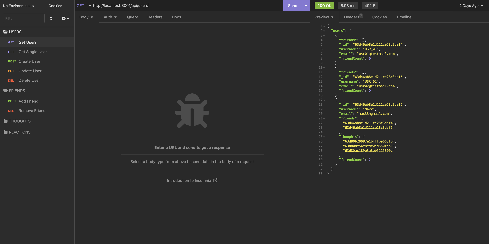

    - Get single user: http://localhost:3001/api/users/:idUser  
    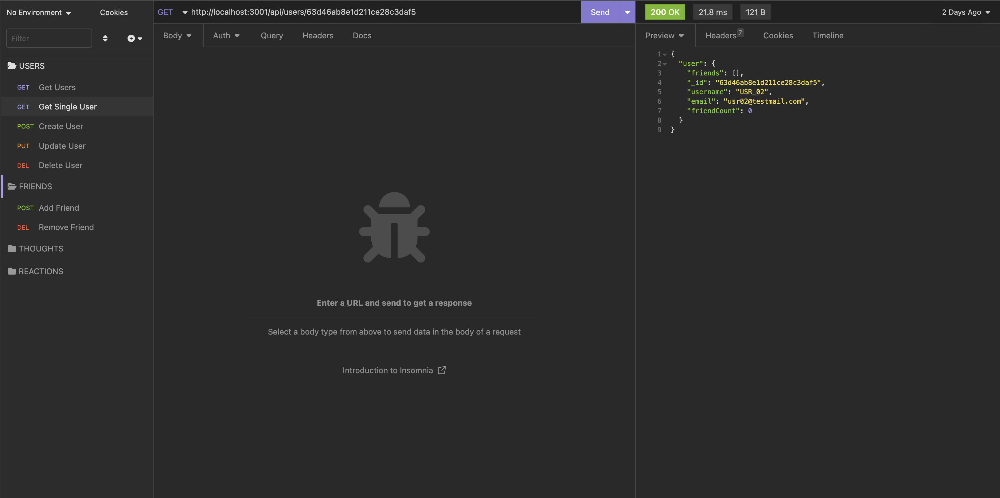  

    - Create user: http://localhost:3001/api/users/  
    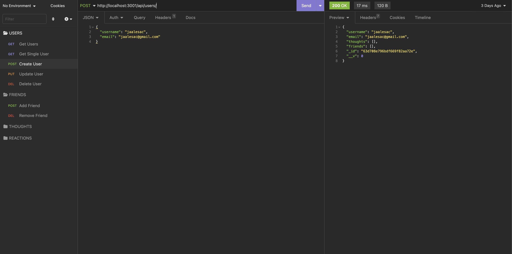  

    - Update user: http://localhost:3001/api/users/:idUser  
    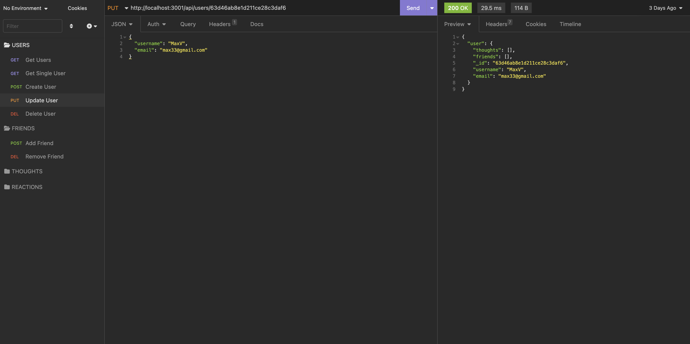  

    - Delete user: http://localhost:3001/api/users/:idUser  
    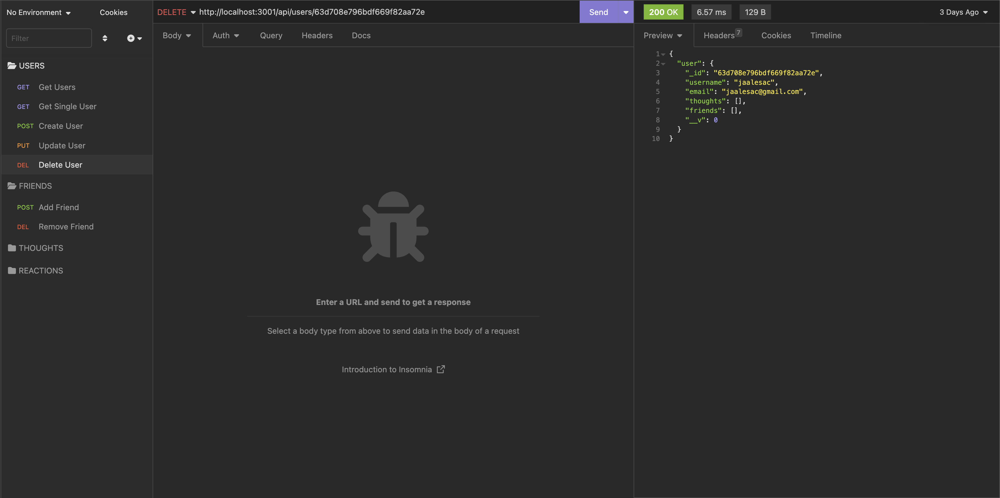  

    - Add friend to User: http://localhost:3001/api/users/:userId/friends/:friendId  
    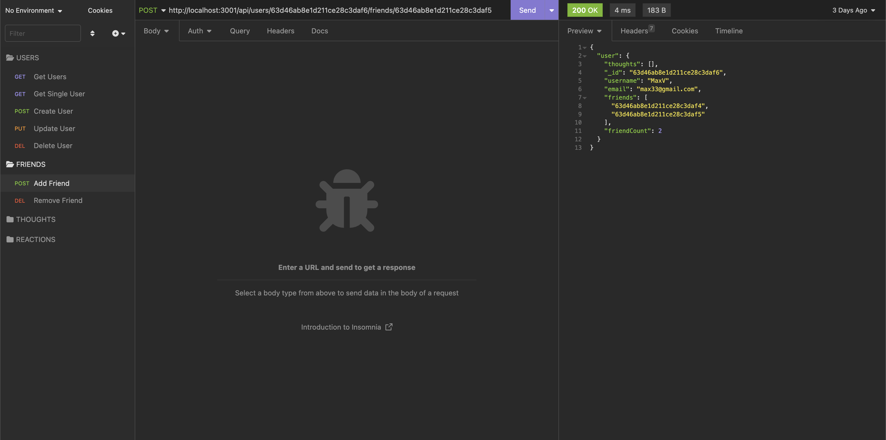  

    - Remove friend form User: http://localhost:3001/api/users/:userId/friends/:friendId  
    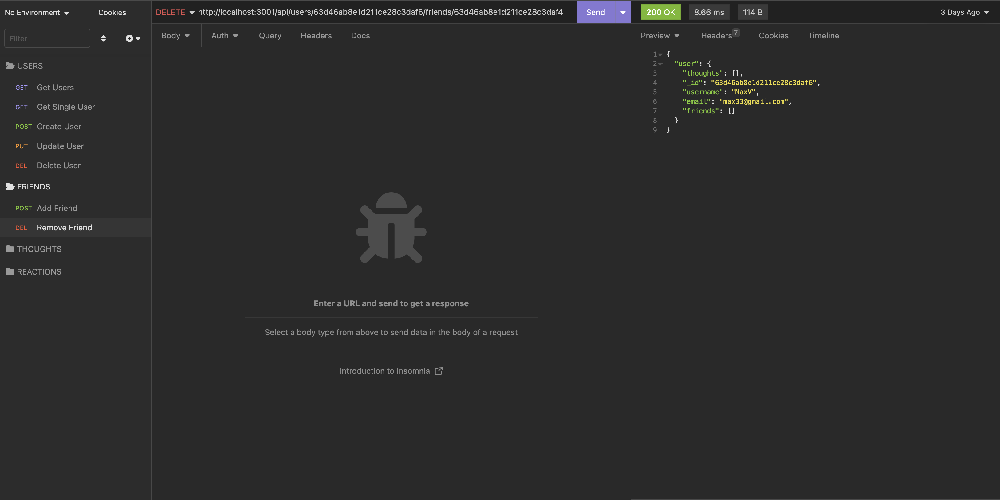  

3. To perform CRUD operations on THOUGHT, use the following paths in insomnia: 

    - Get all thoughts: http://localhost:3001/api/thoughts/  
    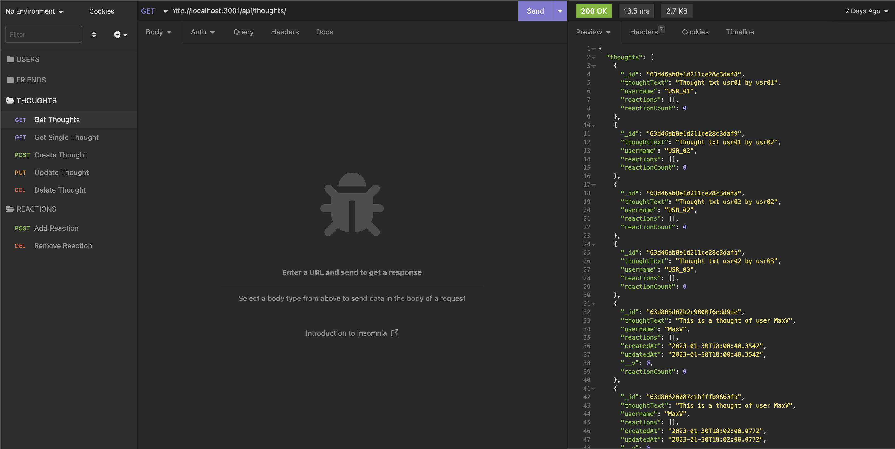  

    - Get single thought: http://localhost:3001/api/thoughts/:idThought   
    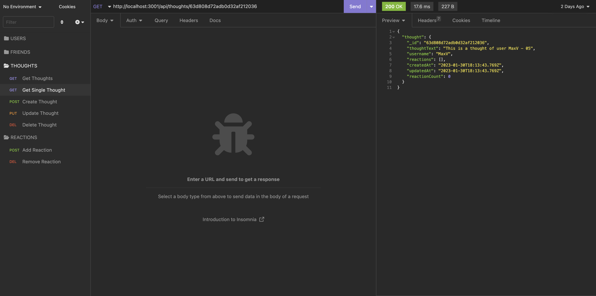  

    - Create user: http://localhost:3001/api/thoughts/  
    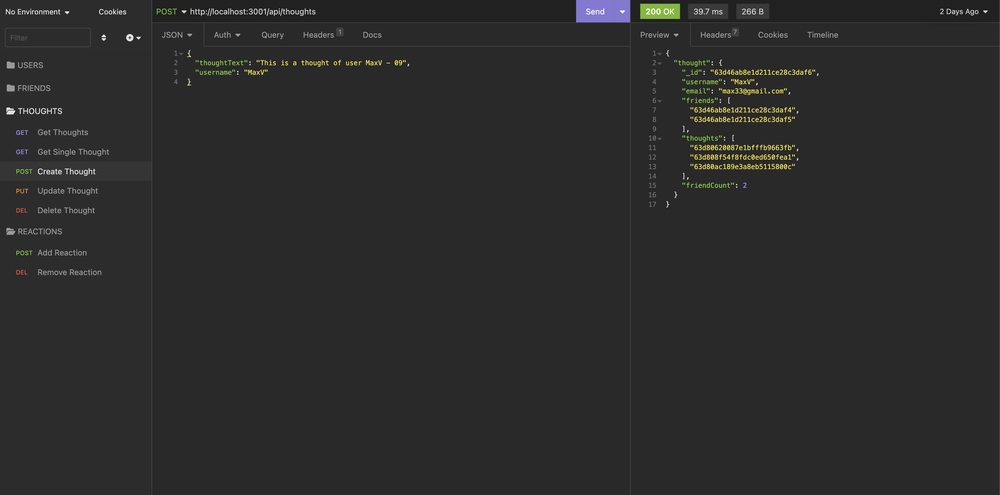  

    - Update user: http://localhost:3001/api/thoughts/:idThought  
    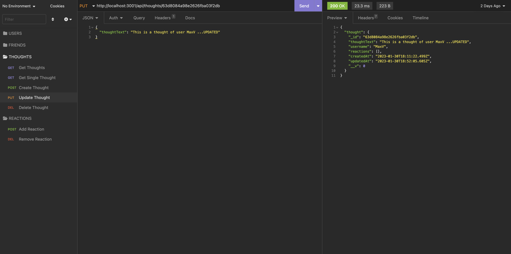  

    - Delete user: http://localhost:3001/api/thoughts/:idThought   
    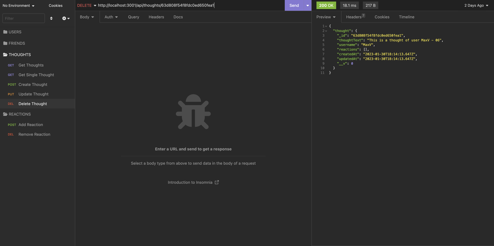  

    - Add Reaction to Thought: http://localhost:3001/api/thoughts/:thoughtId/reactions  
    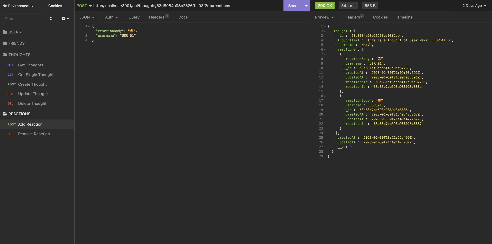  

    - Remove Reaction form Thought: http://localhost:3001/api/thoughts/:thoughtId/reactions/:reactionId  
    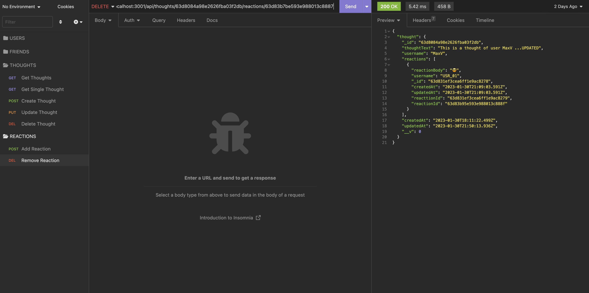  

## Licenses

### MIT
https://opensource.org/licenses/MIT  

-- 

## Contributing

Jaime Esquivel https://github.com/jaime-a-esquivel-a

--

## Tests

No tests were developed for this app.

--

## Questions

Please contact the author:

Name: Jaime Esquivel

e-mail: jaime.a.esquivel.a@gmail.com

GitHub User: https://github.com/jaime-a-esquivel-a

GitHub Repo: https://github.com/jaime-a-esquivel-a/StartUpSocialApp
